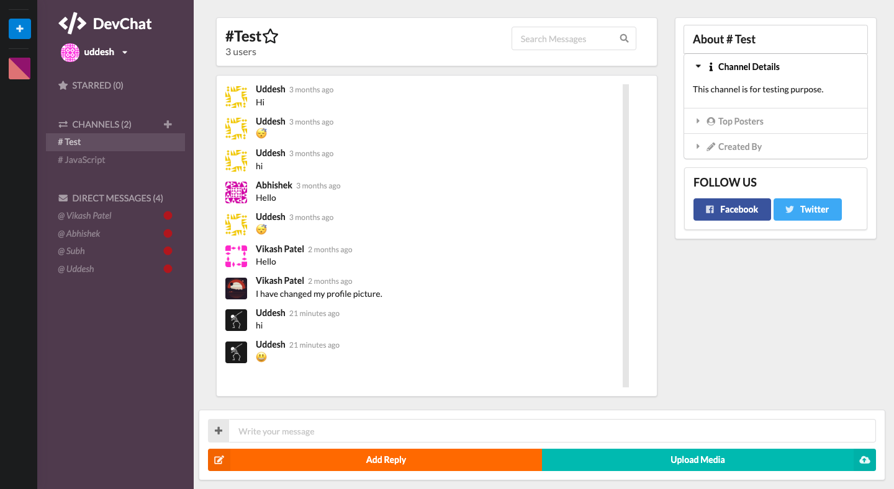

# DevChat App

DevChat is clone of Slack. It has most of the feature of slack.

## Project Overview

DevChat web app build with ReactJS and uses firebase for backend. It has simple and interactive user interface. You just need to login/signup and you are good to go. DevChat supports themes so you can change colors as you like.

### [Live demo](https://realtime-chat-app88.firebaseapp.com/)

<p>
    
</p>

## Instructions

1. Clone this repository to your local machine ( ```git clone <url>``` )
2. Go inside the project directory and then to ```src``` folder inside ```src``` find ```firebase.js``` and replace all credentials with your firebase credentials
3. open the terminal and browse to root directory of the project and run ```npm install```command
4. Now run ```npm start```
5. That's it
